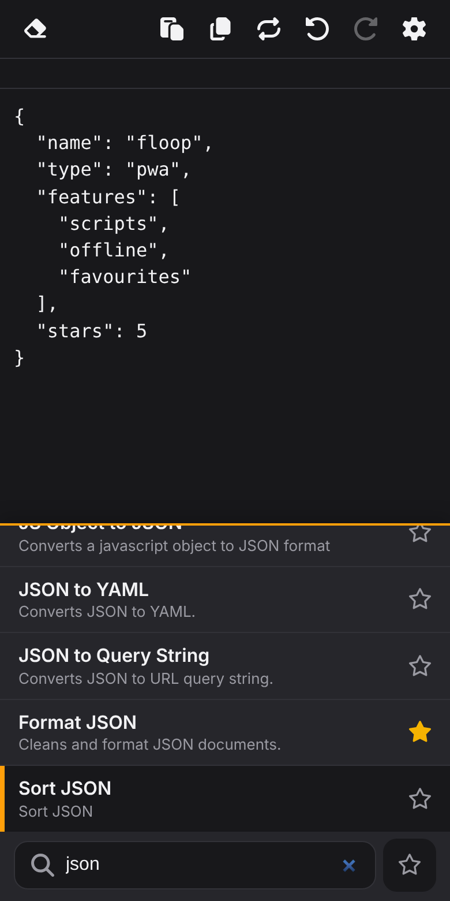

# Floop

**[Boop](https://github.com/IvanMathy/Boop) on any device.** A scratchpad that transforms text with small JavaScript scripts: format JSON, encode Base64, sort lines, hash, and about a hundred more. It's an offline-capable web app (PWA) for phones, tablets and desktops, and it runs Boop's own scripts unchanged.

  

**Open it: <https://wabiloo.github.io/floop/>** in any modern browser. To install it as an app: iPhone/iPad, Safari → Share → **Add to Home Screen**; Android, Chrome → menu → **Install app**; desktop, Chrome or Edge → the install icon in the address bar.

- Pick a script from the always-visible list (fuzzy search, favourites), and it rewrites your selection or the whole text. Undo, copy and paste included.
- Works offline, and syncs scripts from this repo (or any GitHub folder you add).
- Write your own scripts in the app, import them from a link, or have Claude or ChatGPT write them. Publish them back to GitHub if you like.
- Run scripts from other apps through deep links (for example the iOS Shortcuts app and Share Sheet).

Everything about the app is in **[web/README.md](web/README.md)**. The app lives in [`web/`](web/) and is deployed by [`.github/workflows/pages.yml`](.github/workflows/pages.yml). Your own scripts go in [`Scripts/`](Scripts/).

Floop is a fork of [IvanMathy/Boop](https://github.com/IvanMathy/Boop), the macOS app, and is not affiliated with it. The scripts, the script format and the idea are Boop's (MIT licence, see [LICENSE](LICENSE)). The rest of this file is Boop's original README for the Mac app.

If you're just trying to get Boop, building from source might not be your best bet. Developing new scripts does not require building from source.

---

# Documentation

- [Custom scripts](Boop/Documentation/CustomScripts.md)
